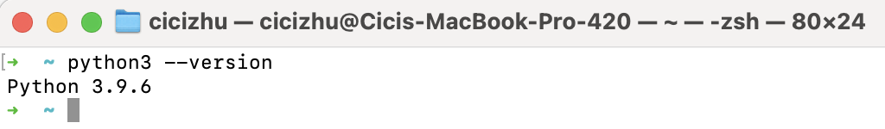
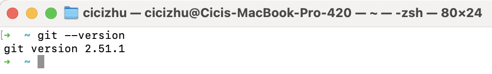
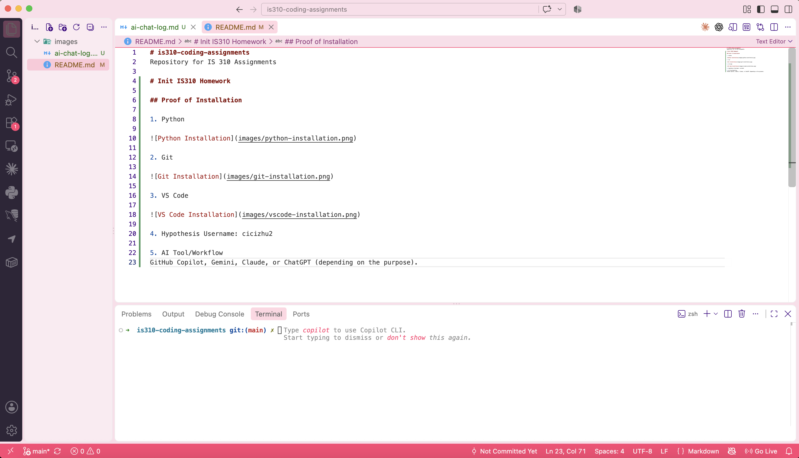

# is310-coding-assignments
Repository for IS 310 Assignments

# Init IS310 Homework

## Proof of Installation

1. Python

2. Git

3. VS Code

4. Hypothesis Username: cicizhu2

5. AI Tool/Workflow: GitHub Copilot, Gemini, Claude, or ChatGPT (depending on the purpose).