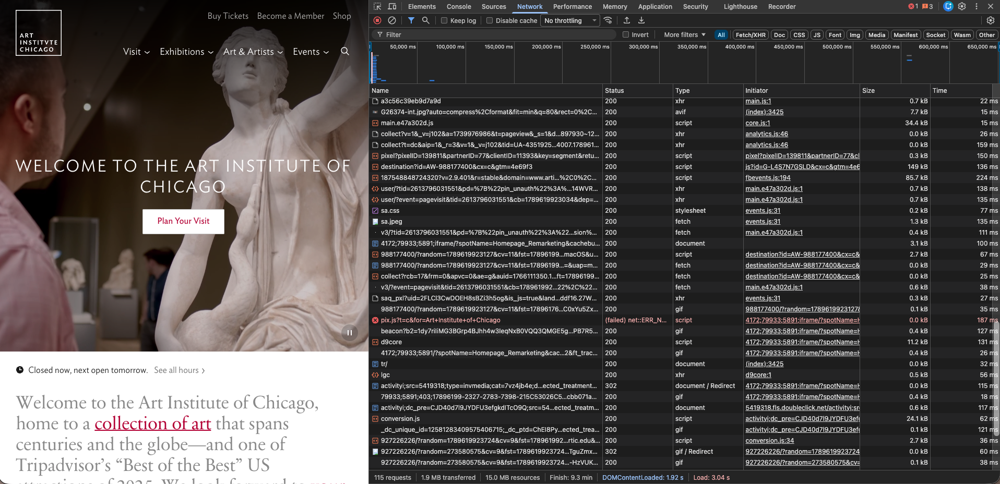

# Assignment 1: Inspecting the Cultural Web

**Website:** https://www.artic.edu
**GitHub repository:** https://github.com/art-institute-of-chicago/website

## Web technologies
Using the browser's DevTools Network tab, I found the site loads `.html`, `.css`, and `.js` files. I also saw files I didn't recognize at first, such as `.woff2` (web fonts), `.svg` (vector icons), and `.json` (data from the museum's API). The GitHub repository shows the site is mainly built with PJP (65.2%) and Blade (33.3%), so the HTML is generated on the server rather than written by hand.

## Who built it
The site was built by the Art Institute of Chicago's in-house digital experience team. The GitHub repository lists 13 contributors, which suggests a small to medium team maintained it over time. The museum publishing its code openly under its own GitHub organization shows it was an institutional project.